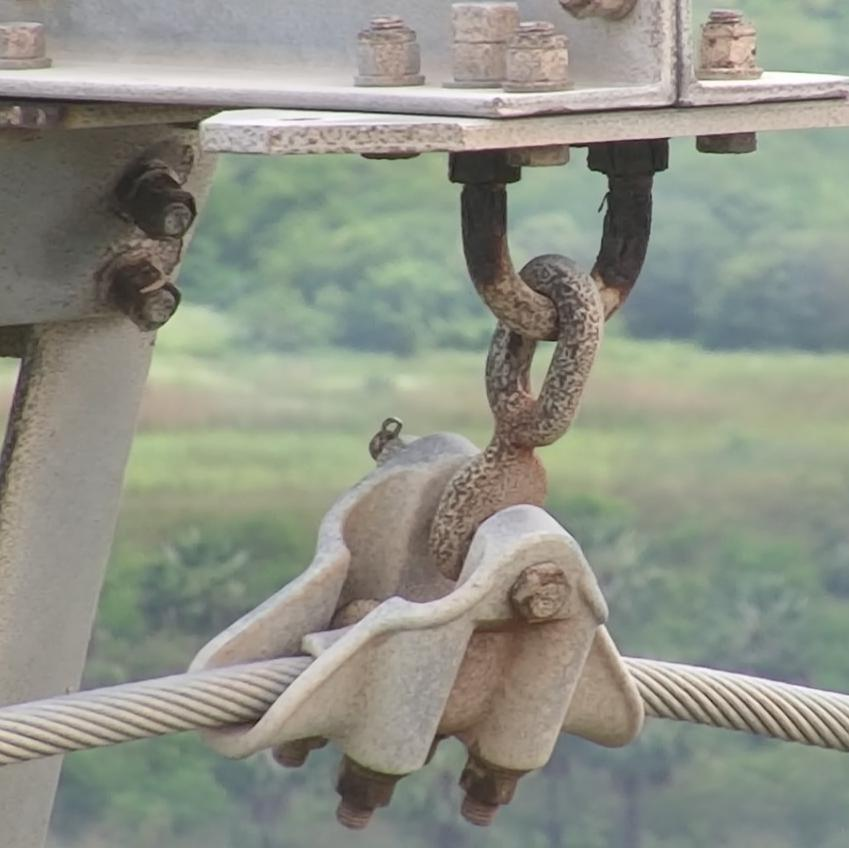

# Defect-Classification-InsPLAD-EfficientNet
Given the detected power line asset image, it is classified according to its current conditions e.g. good or rust.

 ## **Dataset**

The InsPLAD-fault dataset from the 2023 paper “*[InsPLAD: A Dataset and Benchmark for Power Line Asset Inspection in UAV Images](https://arxiv.org/abs/2311.01619)*” was used. The fault classification dataset included data augmented using Albumentations library Buslaev et al. (2020) to increase the training data by 10 times wherever needed. Augmentations included changes in brightness, contrast, histogram equalization, PCA color augmentation, rotation, horizontal mirroring, sharpening and blurring. 
 
## **Classifier**

EfficientNet-B0 was used as the classifier for defect detection. EfficientNet is designed to be lightweight and computationally efficient. This is crucial for applications with limited hardware resources or when real-time processing is required, such as on mobile devices or edge computing platforms. Its pre-trained weights and ability to leverage transfer learning make it a practical solution, particularly for datasets with potentially limited samples.

## **Results**

<table>
  <tr>
   <td>Defect Class
   </td>
   <td>Number of Training Samples Used
   </td>
   <td>Number of Testing Samples Used
   </td>
   <td>Balanced Accuracy
   </td>
  </tr>
  <tr>
   <td>Polymer-insulator-upper-shackle
   </td>
   <td>Good: 742

Rust:  740
   </td>
   <td>Good: 33

Rust:  31
   </td>
   <td>93.94%
   </td>
  </tr>
  <tr>
   <td>Lightning-rod-suspension
   </td>
   <td>Good: 348

Rust:  310
   </td>
   <td>Good: 231

Rust: 20
   </td>
   <td>97.28%
   </td>
  </tr>
  <tr>
   <td>Glass-insulator
   </td>
   <td>Good: 691

Missing-Cap: 690
   </td>
   <td>Good: 29

Missing-Cap: 30
   </td>
   <td>83.22%
   </td>
  </tr>
</table>

## **Detailed Class Reports**

### **Polymer-insulator-upper-shackle**

**Class Labels:** Good, Rust    
**Balanced Accuracy:** 93.94%

<table>
  <tr>
   <td>Confusion Matrix
   </td>
   <td>Precision-Recall Curve
   </td>
  </tr>
  <tr>
   <td>

   </td>
   <td>

   </td>
  </tr>
</table>

#### **Correctly Classified Example Images**

<table>
  <tr>
   <td>True: Rust \
Predicted: Rust
   </td>
   <td>True: Rust \
Predicted: Rust
   </td>
   <td>True: Good \
Predicted: Good
   </td>
   <td>True: Good \
Predicted: Good
   </td>
  </tr>
  <tr>
   <td>

  </td>
   <td>

   </td>
   <td>

   </td>
   <td>

   </td>
  </tr>
</table>

				

#### **Misclassified Example Images**

<table>
  <tr>
   <td>True: Rust \
Predicted: Good
   </td>
   <td>True: Rust \
Predicted: Good
   </td>
  </tr>
  <tr>
   <td>

   </td>
   <td>

   </td>
  </tr>
</table>

			

### **Lightning-rod-suspension**

**Class Labels:** Good, Rust     
**Balanced Accuracy:** 97.28% 

<table>
  <tr>
   <td>Confusion Matrix
   </td>
   <td>Precision-Recall Curve
   </td>
  </tr>
  <tr>
   <td>

   </td>
   <td>

   </td>
  </tr>
</table>

#### **Correctly Classified Example Images**

<table>
  <tr>
   <td>True: Good \
Predicted: Good
   </td>
   <td>True: Good \
Predicted: Good
   </td>
   <td>True: Rust \
Predicted: Rust
   </td>
   <td>True: Rust \
Predicted: Rust
   </td>
  </tr>
  <tr>
   <td>

   </td>
   <td>

   </td>
   <td>

   </td>
   <td>

   </td>
  </tr>
</table>

#### **Misclassified Example Images**

<table>
  <tr>
   <td>True: Rust \
Predicted: Good
   </td>
   <td>True: Good \
Predicted: Rust
   </td>
  </tr>
  <tr>
   <td>

   </td>
   <td>

   </td>
  </tr>
</table>

		

### **Glass-insulator**

**Class Labels:** Good, Missing-Cap     **Balanced Accuracy:** 93.94%

<table>
  <tr>
   <td>Confusion Matrix
   </td>
   <td>Precision-Recall Curve
   </td>
  </tr>
  <tr>
   <td>

   </td>
   <td>

   </td>
  </tr>
</table>

#### **Correctly Classified Example Images**

<table>
  <tr>
   <td>True: Good \
Predicted: Good
   </td>
   <td>True: Good \
Predicted: Good
   </td>
   <td>True: Missing-cap \
Predicted: Missing-cap
   </td>
   <td>True: Missing-cap \
Predicted: Missing-cap
   </td>
  </tr>
  <tr>
   <td>

   </td>
   <td>

   </td>
   <td>

   </td>
   <td>

   </td>
  </tr>
</table>

				

#### **Misclassified Example Images**

<table>
  <tr>
   <td>True: Missing-cap \
Predicted: Good
   </td>
   <td>True: Missing-cap \
Predicted: Good
   </td>
  </tr>
  <tr>
   <td>
     
   </td>
   <td>
    
   </td>
  </tr>
</table>

### **Future Improvements**

Higher level EfficientNets(B1-B7) can be experimented with to achieve higher accuracy. With access to a bigger and diverse dataset and more training resources, richer models using Vision Transformers can be trained to further improve accuracy.
